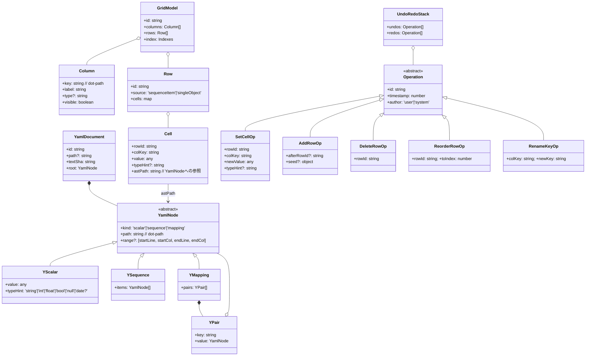
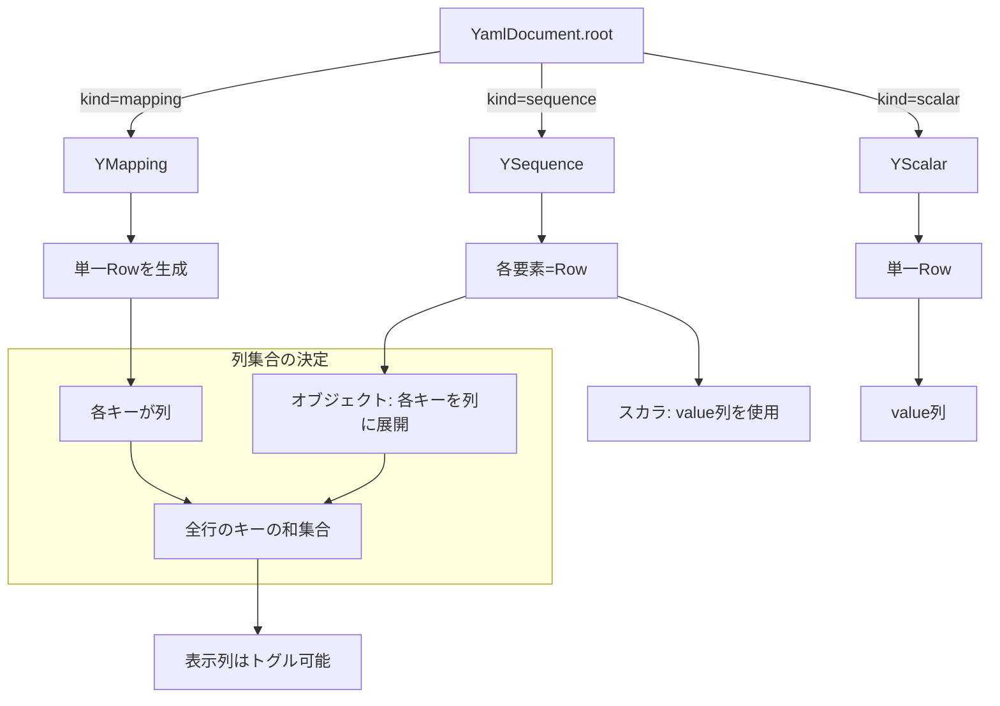
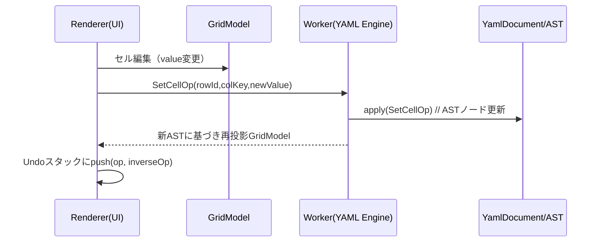
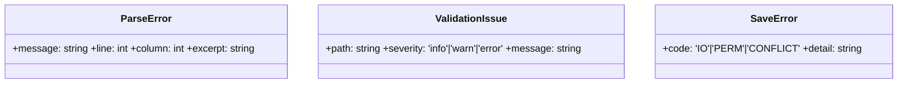
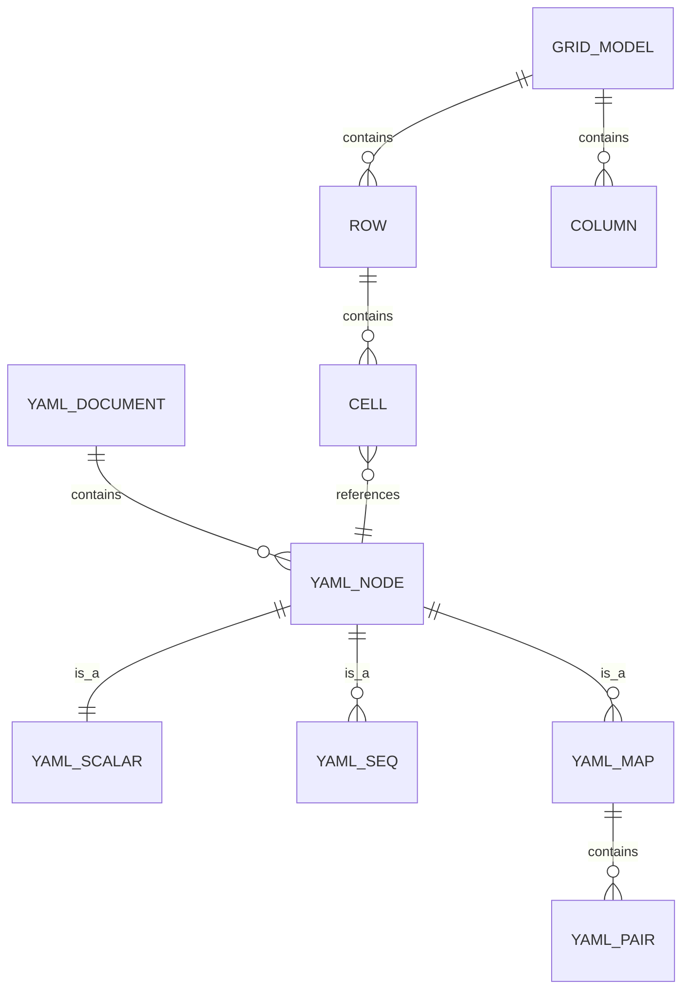

# 詳細設計（Data Model 中心）

本書は PRD/ARCHITECTURE を踏まえ、データモデルと編集操作の詳細を定義します。コードは含みません。Mermaid で関連を視覚化しています。

## 1. モデル全体像（主要エンティティ）


要点:
- YAMLはASTとして保持（順序/位置情報の将来拡張に対応）。
- GridModelはUI投影モデルで、セルはASTノードに参照（`astPath`）を持つ。
- 編集はOperationで表現し、Undo/RedoはOperationのスタックで管理。

## 2. YAML→グリッド投影ルール

補足:
- ネストは `a.b.c` 形式のdot-pathで列化。
- 欠損キーは空セルで表現。列`type`は推定または最初の非空値から推測。

## 3. Operation と AST 変換


逆操作の生成（例）:
- SetCellOp: 逆は `SetCellOp(rowId,colKey,oldValue)`
- AddRowOp: 逆は `DeleteRowOp(rowId)`
- DeleteRowOp: 逆は `AddRowOp(afterRowId?, seed=deletedRowSnapshot)`
- ReorderRowOp: 逆は `ReorderRowOp(rowId, oldIndex)`

AST適用の原則:
- すべてのOpは「特定の`astPath`/配列インデックス/キー」に落とし込める。
- 変更後は`stringify`により保存用テキストを生成可能であること。

## 4. Diff モデル（保存前プレビュー）
```mermaid
classDiagram
  class DiffHunk {
    +type: 'add'|'del'|'mod'
    +oldStart: number
    +oldLines: number
    +newStart: number
    +newLines: number
    +lines: string[] // 表示用
  }
  class TextDiff {
    +hunks: DiffHunk[]
    +stats: {added:int, deleted:int, modified:int}
  }
```

生成フロー:
- 旧: `originalText`（読み込み時）
- 新: `stringify(AST)`
- ライン差分を計算し、`TextDiff`としてUIに表示

## 5. 検索/フィルタ モデル
```mermaid
classDiagram
  class Query {
    +text?: string // 部分一致
    +filters?: map<colKey, Predicate>
  }
  class Predicate {
    +op: 'eq'|'ne'|'contains'|'gt'|'lt'|'isEmpty'
    +value?: any
  }
  class Viewport {
    +visibleRowIds: string[]
    +sortedBy?: {colKey:string, dir:'asc'|'desc'}
  }
```
- QueryはGridModelに対して適用（ASTは不変）。
- 大規模データはインデックス（`Indexes`）で高速化（将来）。

## 6. 検証/エラー モデル

- ParseError: パース時に行・列と近傍テキストを提示。
- ValidationIssue: 型不一致など（将来のスキーマ検証に対応）。
- SaveError: 書き込み失敗や競合時の復旧ガイドに使用。

## 7. ID/参照戦略
- `astPath`: ルートからのdot-path＋インデックス。例: `items[3].name`。
- `rowId`: ルート配列ではインデックス由来の安定IDを採用し、挿入/並べ替え時はUUIDに置換。
- セルは `(rowId,colKey)` の組でユニーク。

## 8. タイプと直列化ポリシー
- typeHintにより曖昧さを回避（例: 先頭0, 日付文字列, 真偽値の文字列化）。
- `stringify`はtypeHintを尊重し、ユーザー意図を保持。
- 将来: コメント/アンカー保持の拡張点をASTに確保。

## 9. IPC ペイロード（抜粋スキーマ）
```mermaid
classDiagram
  class FileOpenRequest { +filters?: {name:string, extensions:string[]}[] }
  class FileOpened { +path:string +content:string }
  class FileSaveRequest { +path:string +content:string }
  class FileSaved { +path:string }
  class FileSaveFailed { +error: SaveError }

  class YamlParseReq { +text:string }
  class YamlParseRes { +astId:string }
  class ProjectReq { +astId:string }
  class ProjectRes { +grid: GridModel }
  class ApplyOpsReq { +astId:string +ops: Operation[] }
  class ApplyOpsRes { +astId:string +grid: GridModel }
  class StringifyReq { +astId:string }
  class StringifyRes { +text:string }
  class DiffReq { +before:string +after:string }
  class DiffRes { +hunks: DiffHunk[] }
```
- 実装時はZod等で型検証を行い、未知フィールドを拒否。

## 10. 性能/スケーラビリティ 注意点（モデル観点）
- GridModelは不変データ構造前提（差分描画に有利）。
- 連続編集はOperationの合成（バッチ）でUndoの肥大化を抑制。
- インデックス（列ごとの値→rowId集合マップ）でフィルタ速度を確保（将来）。

## 11. 品質とテスト観点（モデル）
- プロパティテスト: `applyOps`後に`stringify→parse→project`で同値性（不変条件）を確認。
- 型ラウンドトリップ: `typeHint`維持の単体テスト群。
- 逆操作テスト: 任意Opに対し「適用→逆適用」でAST/Gridが元に戻ることを保証。

---

付録として、最小サンプルの投影イメージ:


以上。
